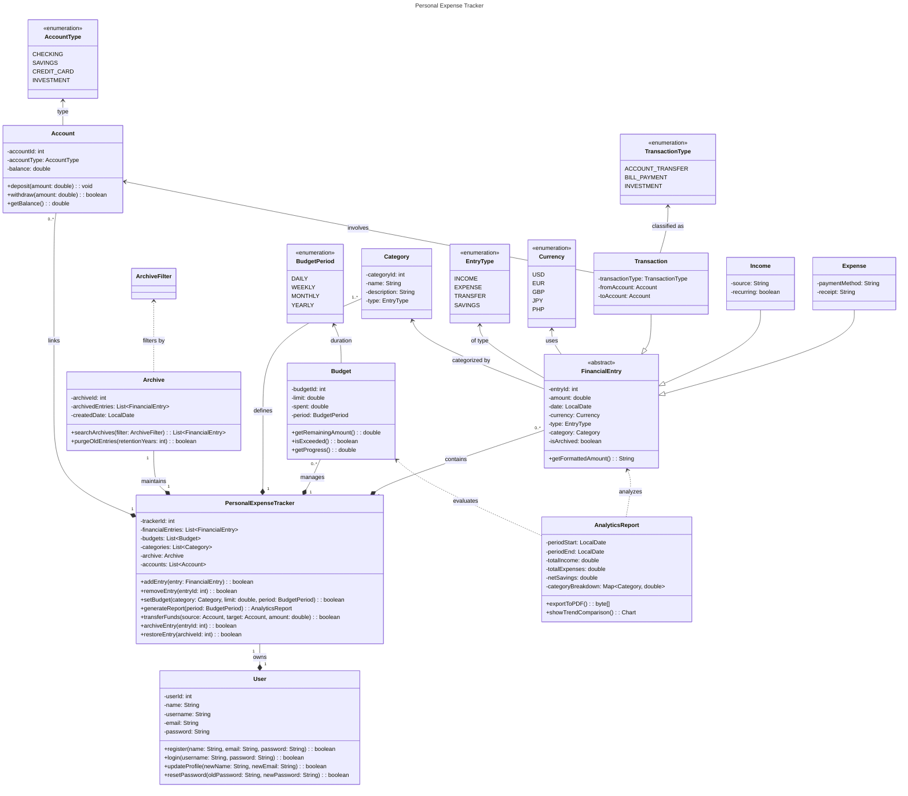

```mermaid
---
title: Personal Expense Tracker
---
classDiagram
    direction BT
    
    class User {
        -userId: int
        -name: String
        -username: String
        -email: String
        -password: String
        +register(name: String, email: String, password: String): boolean
        +login(username: String, password: String): boolean
        +updateProfile(newName: String, newEmail: String): boolean
        +resetPassword(oldPassword: String, newPassword: String): boolean
    }

    class PersonalExpenseTracker {
        -trackerId: int
        -financialEntries: List~FinancialEntry~
        -budgets: List~Budget~
        -categories: List~Category~
        -archive: Archive
        -accounts: List~Account~
        +addEntry(entry: FinancialEntry): boolean
        +removeEntry(entryId: int): boolean
        +setBudget(category: Category, limit: double, period: BudgetPeriod): boolean
        +generateReport(period: BudgetPeriod): AnalyticsReport
        +transferFunds(source: Account, target: Account, amount: double): boolean
        +archiveEntry(entryId: int): boolean
        +restoreEntry(archiveId: int): boolean
    }

    class FinancialEntry {
        <<abstract>>
        -entryId: int
        -amount: double
        -date: LocalDate
        -currency: Currency
        -type: EntryType
        -category: Category
        -isArchived: boolean
        +getFormattedAmount(): String
    }

    class Expense {
        -paymentMethod: String
        -receipt: String
    }

    class Income {
        -source: String
        -recurring: boolean
    }

    class Transaction {
        -transactionType: TransactionType
        -fromAccount: Account
        -toAccount: Account
    }

    class Account {
        -accountId: int
        -accountType: AccountType
        -balance: double
        +deposit(amount: double): void
        +withdraw(amount: double): boolean
        +getBalance(): double
    }

    class Category {
        -categoryId: int
        -name: String
        -description: String
        -type: EntryType
    }

    class Budget {
        -budgetId: int
        -limit: double
        -spent: double
        -period: BudgetPeriod
        +getRemainingAmount(): double
        +isExceeded(): boolean
        +getProgress(): double
    }

    class Archive {
        -archiveId: int
        -archivedEntries: List~FinancialEntry~
        -createdDate: LocalDate
        +searchArchives(filter: ArchiveFilter): List~FinancialEntry~
        +purgeOldEntries(retentionYears: int): boolean
    }

    class AnalyticsReport {
        -periodStart: LocalDate
        -periodEnd: LocalDate
        -totalIncome: double
        -totalExpenses: double
        -netSavings: double
        -categoryBreakdown: Map~Category, double~
        +exportToPDF(): byte[]
        +showTrendComparison(): Chart
    }

    class Currency {
        <<enumeration>>
        USD
        EUR
        GBP
        JPY
        PHP
    }

    class EntryType {
        <<enumeration>>
        INCOME
        EXPENSE
        TRANSFER
        SAVINGS
    }

    class BudgetPeriod {
        <<enumeration>>
        DAILY
        WEEKLY
        MONTHLY
        YEARLY
    }

    class TransactionType {
        <<enumeration>>
        ACCOUNT_TRANSFER
        BILL_PAYMENT
        INVESTMENT
    }

    class AccountType {
        <<enumeration>>
        CHECKING
        SAVINGS
        CREDIT_CARD
        INVESTMENT
    }

    User "1" *-- "1" PersonalExpenseTracker : owns
    PersonalExpenseTracker "1" *-- "0..*" FinancialEntry : contains
    PersonalExpenseTracker "1" *-- "0..*" Budget : manages
    PersonalExpenseTracker "1" *-- "1..*" Category : defines
    PersonalExpenseTracker "1" *-- "1" Archive : maintains
    PersonalExpenseTracker "1" *-- "0..*" Account : links
    FinancialEntry <|-- Expense
    FinancialEntry <|-- Income
    FinancialEntry <|-- Transaction
    FinancialEntry --> Currency : uses
    FinancialEntry --> EntryType : of type
    FinancialEntry --> Category : categorized by
    Account --> AccountType : type
    Transaction --> TransactionType : classified as
    Transaction --> Account : involves
    Budget --> BudgetPeriod : duration
    AnalyticsReport ..> FinancialEntry : analyzes
    AnalyticsReport ..> Budget : evaluates
    Archive ..> ArchiveFilter : filters by
```
